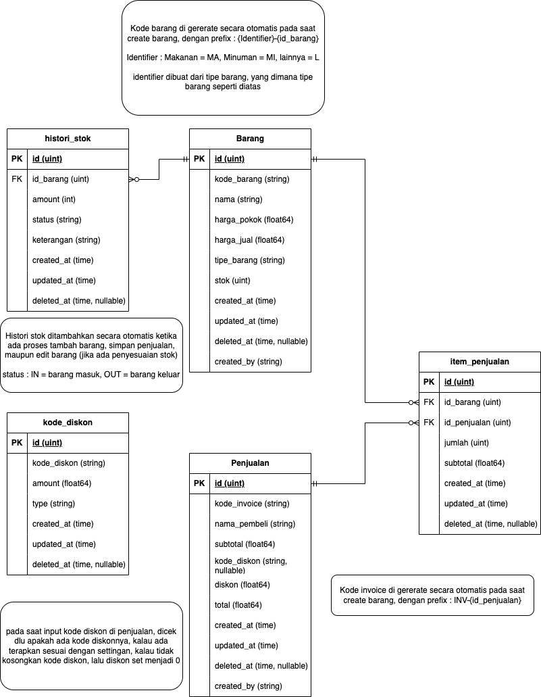

# GO: Retail Shop

The "Retail Shop" project is a Go (Golang) application designed to manage the operations of a retail store. It includes various functionalities such as handling inventory, processing sales, managing discounts, and maintaining historical records. The project uses the GORM library for interacting with a MySQL database, allowing for efficient data management and retrieval.

DB Design:

## Key Features:
### Inventory Management:

- Create Item (Barang): Allows the creation of new items in the inventory. Each item is assigned a unique code (KodeBarang) based on its type, such as "MA-" for food or "MI-" for drinks. The creation process also records metadata such as the creator's identity and timestamps for creation and updates.
- Get All Items: Retrieves a list of all items in the inventory, including their current stock, pricing, and other relevant details.
- Get Item by ID: Fetches detailed information about a specific item based on its ID, including historical changes to the item’s data. The system also handles soft-deleted records, giving feedback if the item has been deleted.
- Update Item: Updates the details of an existing item, such as its name, pricing, and stock levels.
- Delete Item: Soft deletes an item from the inventory, allowing it to be hidden from active records while retaining it in the database for potential recovery.
### Sales Management:

- Generate Invoice: Automatically generates a unique invoice code for each sale transaction, using the transaction ID.
- Insert Sales Data: Records sales transactions into the database, applying any discounts based on provided discount codes. It calculates the final total after discount and stores the transaction along with a generated invoice code.
### Discount Management:

The system allows the application of discounts based on predefined codes. Discounts can be a fixed amount or a percentage of the subtotal. The calculated discount is then applied to the sale, and the final total is updated accordingly.
### Historical Data:

The application keeps track of historical data for items, including changes in pricing, stock adjustments, and sales. This historical data is retrievable and included in various detailed reports and responses.
### Error Handling:

The system includes robust error handling, particularly in database operations. It checks for common issues like record not found, soft-deleted records, and provides descriptive error messages for easier debugging and user feedback.
### Technical Overview:

- Language: Go (Golang)
- Database: MySQL, accessed via GORM, an ORM (Object-Relational Mapping) library for Go.
- Repository Pattern: The project follows a repository pattern, separating the database logic (modelfunc package) from the application logic (utils package).
- Timestamp Management: Automatic management of CreatedAt and UpdatedAt fields to track when records are created and modified.
- Soft Deletion: Items and sales records are soft-deleted, meaning they are marked as deleted in the database without being permanently removed, allowing for data recovery and historical tracking.
### Use Cases:

- Retail Store Owners: Manage their inventory, track sales, and apply discounts efficiently.
- Developers: Extend the system with new features or integrate it with other systems (e.g., online sales platforms).
- Data Analysts: Analyze historical data on inventory and sales to make informed business decisions.
